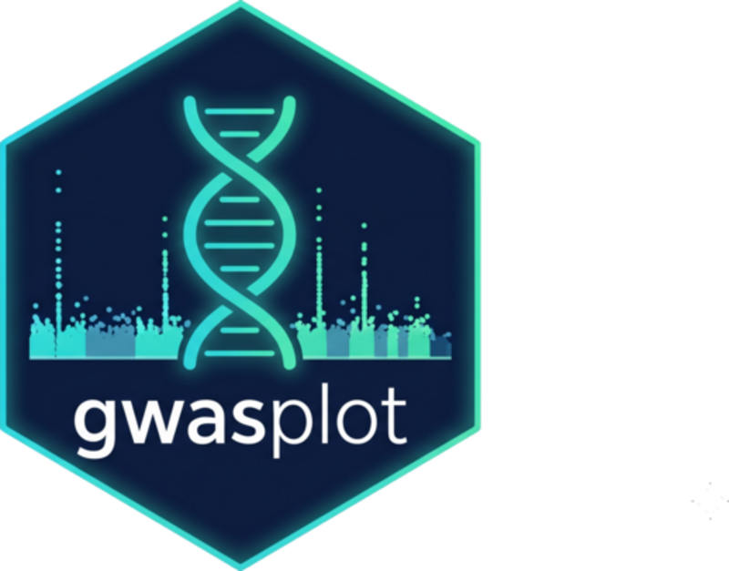
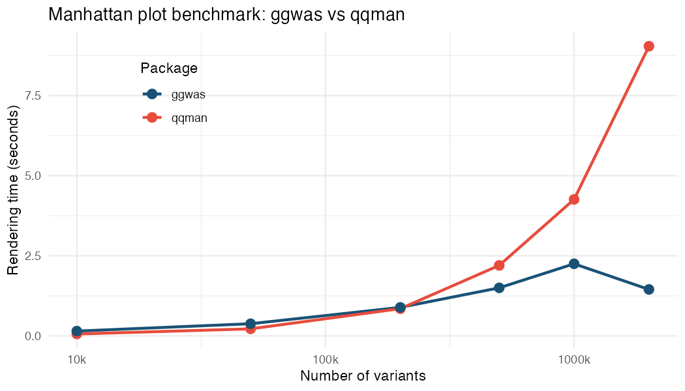

# ggwas 

<!-- badges: start -->
[](https://github.com/bczech/ggwas/actions/workflows/R-CMD-check.yaml) [](https://codecov.io/gh/bczech/ggwas) [](https://lifecycle.r-lib.org/articles/stages.html#experimental) [](https://opensource.org/licenses/MIT) [](https://doi.org/10.5281/zenodo.20815110) [](https://bczech.github.io/ggwas/)
<!-- badges: end -->

Modern, fast, and fully customizable GWAS visualizations built on
**ggplot2**. Designed for publication-ready figures with sensible defaults
and journal-specific themes.

## Key features

- **10 plot types** including novel visualizations not available elsewhere
- **Smart downsampling** for 10M+ variant datasets
- **Journal themes** (Nature, Science, Cell, PLOS) and 14 color palettes
- **Gene annotation** with automatic nearest-gene mapping
- **Auto-detects** column names from PLINK, REGENIE, GCTA, GEMMA, and generic files
- **Fully composable** — every function returns a ggplot object

## Comparison

| Feature | qqman | CMplot | **ggwas** |
|---|---|---|---|
| ggplot2-native | No | No | **Yes** |
| Manhattan + QQ | Yes | Yes | **Yes + CI + lambda + stratified** |
| Miami plot | No | No | **Yes** |
| Locus Zoom | No | No | **Yes (with LD + gene track)** |
| Circular Manhattan | No | Yes (base R) | **Yes (ggplot2, multi-ring)** |
| Enrichment Manhattan | No | No | **Yes (novel)** |
| Multi-trait overlay | No | No | **Yes (novel, pleiotropy)** |
| Genome-wide heatmap | No | No | **Yes (novel)** |
| Effect-size volcano | No | No | **Yes (novel)** |
| Summary dashboard | No | No | **Yes (novel)** |
| Gene labels on peaks | No | No | **Yes** |
| Region highlights | No | No | **Yes** |
| Top hits table | No | No | **Yes (with clumping)** |
| Journal themes | No | No | **6 themes + 4 presets** |
| Color palettes | Limited | Limited | **14 palettes (colorblind-safe)** |
| Auto-detect formats | No | No | **Yes** |
| Smart downsampling | No | No | **Yes** |

## Installation

```r
pak::pak("bczech/ggwas")
```

## Quick start

```r
library(ggwas)

# Read any GWAS results file — columns auto-detected
gwas <- read_gwas_table("my_results.txt")

# Manhattan plot
manhattan_plot(gwas)

# Label top hits with gene names
manhattan_genes(gwas, genes = my_gene_table, gene_top_n = 10)

# QQ plot with confidence band and lambda
qq_plot(gwas, show_lambda = TRUE)

# Miami plot — discovery vs replication
miami_plot(discovery, replication,
           top_title = "Discovery", bottom_title = "Replication")

# Publication preset
p <- gwas_preset("publication")
manhattan_plot(gwas, colors = p$colors, point_size = p$point_size) + p$theme
```

## Supported input formats

| Format | Function |
|---|---|
| Generic (auto-detect) | `read_gwas_table()` |
| PLINK .assoc/.linear/.logistic | `read_plink_assoc()` / `_linear()` / `_logistic()` |
| REGENIE | `read_regenie()` |
| GCTA MLMA | `read_gcta_mlma()` |
| GEMMA | `read_gemma()` |
| Any data.frame | Pass directly with column mapping |

## Plot gallery

### Core plots

```r
manhattan_plot(gwas, label_top_n = 5)
qq_plot(gwas, show_lambda = TRUE, ci = 0.95)
miami_plot(gwas1, gwas2, top_title = "Study 1", bottom_title = "Study 2")
locus_plot(gwas, lead_snp = "rs12345", flank = 500000)
```

### Novel visualizations

```r
pvalue_heatmap(gwas, bin_size = 1e6, palette = "magma")
volcano_plot(gwas, label_top_n = 10, color_by = "chromosome")
circular_manhattan(gwas, colors = gwas_palette("nature"))
circular_manhattan(list(BMI = gwas1, Height = gwas2))  # multi-ring
enrichment_manhattan(gwas, annotations = functional_regions)
multitrait_manhattan(BMI = gwas1, Height = gwas2, highlight_shared = TRUE)
gwas_summary(gwas)  # multi-panel dashboard
```

### Gene annotation

```r
# Label peaks with nearest gene names (instead of rs IDs)
manhattan_genes(gwas, genes = gene_table, arrow = TRUE)

# Extract independent top hits with gene mapping
top_hits(gwas, genes = gene_table, p_threshold = 5e-8)

# Highlight genomic regions
plt <- manhattan_plot(gwas)
highlight_regions(plt, data.frame(chr = 6, start = 25e6, end = 34e6, label = "MHC"))
```

### Themes and palettes

```r
# Journal themes
manhattan_plot(gwas) + theme_nature()
manhattan_plot(gwas) + theme_science()
manhattan_plot(gwas) + theme_cell()
manhattan_plot(gwas) + theme_plos()

# Presentation / poster
manhattan_plot(gwas) + theme_presentation()
manhattan_plot(gwas) + theme_poster()

# 14 color palettes
gwas_palettes()
manhattan_plot(gwas, colors = gwas_palette("nature"))
```

## Performance

Smart downsampling kicks in automatically for large datasets. It preserves
all significant variants and bins the non-significant background — the plot
looks identical but renders in seconds instead of minutes:

| Variants | qqman | ggwas | Speedup |
|---|---|---|---|
| 50k | 0.19s | 0.20s | ~1x |
| 200k | 0.78s | 0.42s | **1.9x** |
| 500k | 1.81s | 1.03s | **1.8x** |
| 1M | 4.24s | 1.73s | **2.5x** |
| 2M | 9.00s | 2.28s | **3.9x** |



```r
manhattan_plot(large_gwas)  # 10M SNPs, auto-downsampled to ~200k points
```

## Documentation

Full documentation with worked examples: **https://bczech.github.io/ggwas/**

Or from R:

```r
vignette("ggwas")
```

## Citation

```
Czech B (2026). ggwas: Modern ggplot2 Visualizations for Genome-Wide
Association Studies. R package version 0.99.2.
https://github.com/bczech/ggwas
doi: 10.5281/zenodo.20815110
```

## License

MIT
